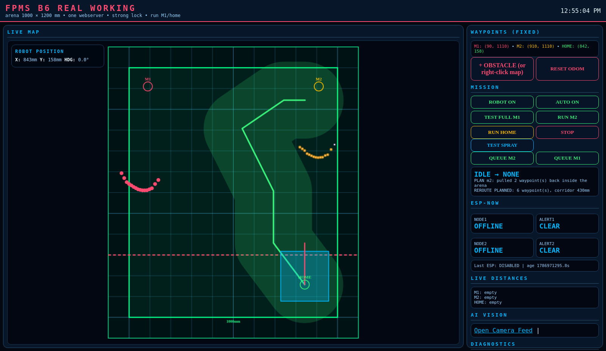

# The rover, and what it actually does

> Technical documentation lives in
> **[FPMS-Industrial](https://github.com/FPMS-FPMS/FPMS-Industrial)** —
> [navigation](https://github.com/FPMS-FPMS/FPMS-Industrial/blob/main/docs/rovers/NAVIGATION.md) ·
> [calibration](https://github.com/FPMS-FPMS/FPMS-Industrial/blob/main/docs/rovers/CALIBRATION.md) ·
> [dashboard](https://github.com/FPMS-FPMS/FPMS-Industrial/blob/main/docs/rovers/DASHBOARD.md) ·
> [source](https://github.com/FPMS-FPMS/FPMS-Industrial/blob/main/software/rover2/fpms_phase6.py)

## The mission

From a start box, drive to a target zone in a 1000 x 1200 mm arena, avoid an
obstacle placed in between, hold position for two seconds, and return home.

A full round trip takes 25-35 seconds. Turns land within 1-3 degrees.

## What the operator sees

Everything the rover knows is on one screen, served by the rover itself. No
laptop debugger, no cloud dependency - open a browser at port 8085.



Red dots are live LiDAR returns. The green line is the planned route and the
green band around it is the clearance the planner guarantees, so an operator can
see at a glance whether a plan is comfortable or scraping past something.

## The engineering decision we are proudest of

**We stopped trusting a sensor.**

The rover's inertial sensor under-reads how far it has turned by a factor of
four to five. Parked, it reads correctly. Only under rotation does it lie - which
is exactly what made it expensive to find.

So the rover measures its own turns a different way: it photographs the room with
its LiDAR before turning, again afterwards, and rotates one scan against the
other until they line up. That angle is the truth. It shares no hardware with the
inertial sensor, so the two cannot fail in the same direction.

The inertial reading is still printed beside every turn in the log:

```
rotated +83 by LiDAR in 3 pulses (tgt +80, err -3; IMU said +35)
```

Keeping the disagreement visible is how the error was found, and it stays there
so it cannot quietly come back.

## Honest limits

- The two-joint route is preferred, but if no two-joint path clears the obstacle
  by 196 mm the rover drives a longer, uglier route instead. Safety outranks shape.
- The zone centre is not always reachable. A 230 mm-wide rover cannot centre on a
  point 90 mm from a wall, so it docks at the nearest pose inside the zone.
- Turn accuracy degrades as the battery sags, and the computer browns out near
  11.0 V. Results measured on a low pack are not reproducible.
